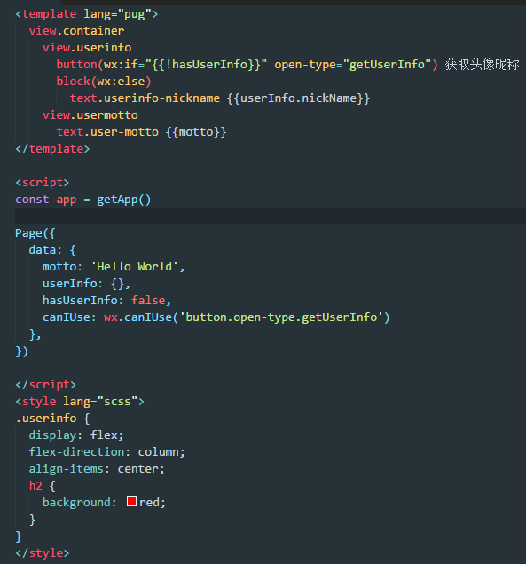
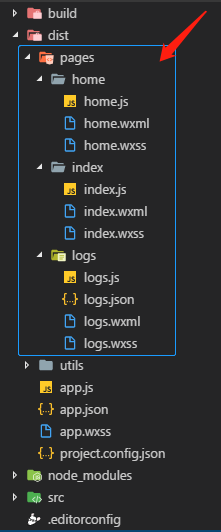

# 微信 / 支付宝小程序loader

> 解析拆分单页面模块`<template>` `<script>` `<style>`至对应的html,js,css文件

### 安装

```bash
npm install miniprogram-loader --save-dev
```

### 配置使用 (以配置微信小程序为例)
**webpack.config.js**
```js
module.exports = {
  module: {
    rules: [
      {
        // 可自行设置需要的模板后缀
        test: /\.kico$/,
        loader: 'miniprogram-loader',
        options: {
          // 配置解析html后缀
          htmlExt: 'wxml',
          // 配置解析wxss后缀
          cssExt: 'wxss',
          // 配置解析js后缀
          jsExt: 'js'
        }
      }
    ]
  }
}
```

### 单页面的结构

参照vue的设计单例



### webpack打包后的结果


**提示**：可以根据需要设置template的lang语法以及style的lang语法
